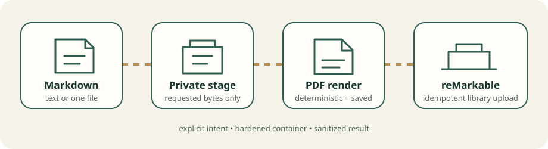

# reMarkable Markdown Publisher for Codex

[](https://github.com/AzatArslanov/remarkable-codex/actions/workflows/ci.yml)
[](https://www.python.org/)
[](LICENSE)

Turn Markdown reports, investigation results, and notes into paper-friendly PDFs and publish them to your reMarkable library from Codex.

> [!IMPORTANT]
> This is an unofficial community project. It uses a private, observed reMarkable upload endpoint documented in [ADR 0004](docs/adr/0004-simple-upload.md), not an official public publishing API. Protocol changes can break uploads without notice.



The plugin provides:

- natural-language publishing through Codex with `upload_markdown`
- inline Markdown and UTF-8 text-file input
- deterministic, content-addressed PDF rendering
- explicit publication intent for every upload
- local retry suppression, preserved failure artifacts, and sanitized results

## Quick start

### 1. Install the prerequisites

You need:

- [Codex CLI or the ChatGPT desktop app with plugin support](https://learn.chatgpt.com/docs/plugins)
- Docker Desktop or Docker Engine
- Git
- Python 3.11 through 3.14
- a reMarkable account paired with its cloud library

### 2. Clone, install, and build

For Codex's default personal marketplace layout, clone the repository at this path:

```bash
mkdir -p "$HOME/plugins"
git clone https://github.com/AzatArslanov/remarkable-codex.git "$HOME/plugins/remarkable-codex"
cd "$HOME/plugins/remarkable-codex"
python3 -m venv .venv
. .venv/bin/activate
python -m pip install -e .
remarkable-publish-mcp-docker build
```

The final command builds the exact image required by plugin contract `0.3.0`: `remarkable-codex-mcp:0.3.0`. The plugin does not download or silently reuse another image tag.

### 3. Register the local plugin

Codex installs plugins from marketplaces. Until this project is distributed through a public marketplace, add this entry to the `plugins` array in `~/.agents/plugins/marketplace.json`. If the file does not exist, the complete minimal file is:

```json
{
  "name": "personal",
  "interface": {
    "displayName": "Personal"
  },
  "plugins": [
    {
      "name": "remarkable-codex",
      "source": {
        "source": "local",
        "path": "./plugins/remarkable-codex"
      },
      "policy": {
        "installation": "AVAILABLE",
        "authentication": "ON_INSTALL"
      },
      "category": "Productivity"
    }
  ]
}
```

Do not overwrite an existing marketplace file; merge only the plugin object. Then install the plugin:

```bash
codex plugin add remarkable-codex@personal
```

Start a new Codex task after installation so the bundled skill and MCP tool are discovered.

### 4. Pair your reMarkable account

Generate a one-time verification code from the account flow at [my.remarkable.com](https://my.remarkable.com/), then enter it interactively:

```bash
remarkable-publish-mcp-docker auth login
remarkable-publish-mcp-docker auth status
```

The code is read from the terminal prompt, never from a command argument or environment variable. reMarkable's [desktop app pairing guide](https://support.remarkable.com/articles/Knowledge/Desktop-app) documents the same account-code flow.

### 5. Publish from Codex

In a new task, ask naturally:

```text
Publish this Markdown to my reMarkable as "Architecture Review".
```

or:

```text
Send /absolute/path/to/report.md to my reMarkable with the title "Weekly Research".
```

The export skill calls `upload_markdown` once. Delivery is reported only after a recognized remote response and a durable local success record, or when an exact retry is found in that record.

## How it works

```text
Codex task
  -> host stdio MCP discovery (no Docker, credential, or network)
  -> explicit upload_markdown call
  -> one requested file staged privately, when needed
  -> one hardened, short-lived Docker container
  -> deterministic PDF rendered and preserved
  -> private observed upload endpoint behind Publisher
  -> local SQLite success ledger suppresses exact retries
```

For file inputs, the host broker opens only the named regular file, copies at most 10 MB into a private call-scoped directory, mounts that directory read-only at `/imports/0`, and deletes it after the matching response or process exit. The original path, parent directory, home directory, and workspace are never mounted into the container.

Initialization, `ping`, and tool discovery stay on the host and do not start Docker. An actual upload runs one `--rm` container with a read-only root, dropped capabilities, no new privileges, no published port, no Docker socket, finite resources, and an unprivileged user.

See [architecture](docs/architecture.md), [public contracts](docs/contracts.md), and the [security model](docs/security.md) for the complete boundaries.

## Supported Markdown

The renderer supports headings, paragraphs, emphasis, inline code, fenced code, block quotes, ordered and unordered lists, tables, and HTTP(S) or `mailto` links. Common workflow arrows (`←`, `→`, `↔`, `⇒`, `⇔`) use a deterministic symbol-font fallback.

Input that cannot be represented by the renderer's font set fails before upload rather than producing missing-glyph boxes. Files are decoded strictly as UTF-8 and treated as Markdown regardless of their extension.

## Operations

```bash
remarkable-publish-mcp-docker status
remarkable-publish-mcp-docker auth status
remarkable-publish-mcp-docker auth revoke
remarkable-publish-mcp-docker serve
```

`serve` is the lightweight host control plane used by the plugin. It can initialize and list tools without Docker; Docker is first contacted by an `upload_markdown` call.

By default, preserved PDFs are written under the process temporary root. Set the non-secret `REMARKABLE_ARTIFACT_HOST_DIR` before starting Codex when you need a durable custom directory. The device credential and successful-upload ledger remain in the protected `remarkable-publish-state-v1` Docker volume.

### Standalone CLI

The Python package also provides a direct, non-Docker CLI. It uses its own configured state directory and credential, separate from the plugin's Docker volume:

```bash
cp config.example.toml .remarkable-publish.toml
remarkable-publish auth login
remarkable-publish doctor
remarkable-publish upload ./notes.md --title "Project Notes"
```

Invoking `remarkable-publish upload` is also explicit publication intent.

## Idempotency and recovery

The idempotency key covers the normalized title and rendered PDF SHA-256. A state-volume lock serializes ledger lookup, upload, and success recording. Once a recognized success is recorded, an exact local retry returns the recorded remote identifiers without another network call.

This protection is installation-local. It cannot detect uploads performed by another installation or after ledger loss. If delivery succeeds but the ledger cannot record it, the result sets `deliveryStatus=confirmed` and `retrySafe=false`; callers must not retry automatically.

Every successfully rendered PDF remains available after authentication, transport, response-validation, or state failures.

## Security and compatibility

- Credentials are stored with restricted permissions and never accepted in config, command arguments, fixtures, generated documents, or logs.
- Authentication and upload transports are restricted to exact HTTPS hosts and disable redirects.
- Errors exclude remote bodies, headers, tokens, signed URLs, account listings, source paths, and Markdown bodies.
- Unit tests are offline and use synthetic data; they never access a real account.
- The upload endpoint is private observed behavior. The adapter fails closed if its response contract drifts.
- Native editable reMarkable notebooks are proprietary and are not generated or silently substituted.

Please report security issues through the private process in [SECURITY.md](SECURITY.md). General bugs and compatibility reports belong in [GitHub Issues](https://github.com/AzatArslanov/remarkable-codex/issues), without credentials, response bodies, or private document content.

## Development

```bash
python3 -m venv .venv
. .venv/bin/activate
python -m pip install -e '.[dev]'
ruff check .
PYTHONPATH=src python -m unittest discover -s tests -v
python -m compileall -q src tests
docker build --pull --tag remarkable-codex-mcp:0.3.0 .
```

GitHub Actions runs linting and all offline tests on Python 3.11, 3.12, 3.13, and 3.14, then builds and smoke-tests the contract-versioned Docker image. All third-party actions are pinned to full commit SHAs and the workflow has read-only repository permissions.

See [CONTRIBUTING.md](CONTRIBUTING.md) before changing public behavior.

## License

[MIT](LICENSE)
